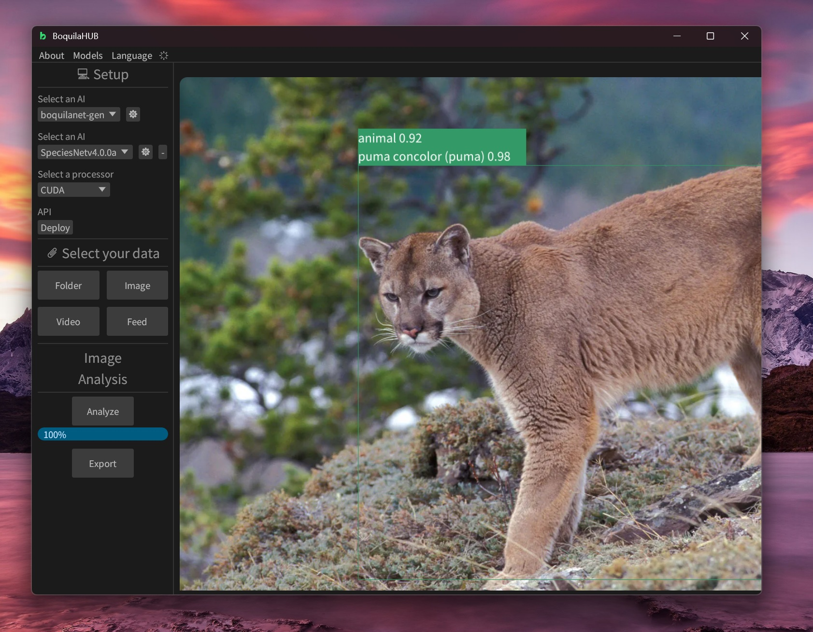

# BoquilaHUB

Cross-platform app to run AI models to monitor and protect nature. Locally, no cloud.



## Features

- Cross-platform
- GUI, TUI and CLI tool
- Run AIs for computer vision and audio, locally
- Process image, video, live feed or audio files
- Deploy and consume REST APIs, with maximum efficiency. Powered by [axum](https://github.com/tokio-rs/axum)

## Installation

Download the latest binaries from [releases](https://github.com/boquila/boquilahub/releases)

We offer two versions, one with both dependencies (ffmpeg and onnxruntime) and one without, in case you have them in your computer already.

## AIs

You can load any [.bq model](https://github.com/boquila/.bq). You can find them on our [website](https://boquila.org/hub).

## List of Platforms

| Platform                           |  Production ready  |
| --------------------------------- |------------ |
| Windows          | ✅ |
| Linux          | ✅ |
| MacOS          | ✅ |
| Android          | On the way |
| Web        | On the way |
| iOS          | Not soon |

## List of Runtimes

| Runtime           | Description                                                                        | Requirements  |
|-------------------|------------------------------------------------------------------------------------|--------------|
| CPU              | Your average CPU                                                                   | Having a CPU |
| NVIDIA CUDA      | CUDA execution provider for NVIDIA GPUs (Maxwell 7xx and above)                    | CUDA v12.8 + cuDNN 9.7 |
| WebGPU | GPU acceleration via the WebGPU API, runs on most devices that support graphics | Having a modern GPU | 
| Remote BoquilaHUB | A BoquilaHUB session in your network with a deployed REST API                     | Having the URL | 

And soon more

## How to compile

If you want to compile from source just have to

```shell
git clone https://github.com/boquila/boquilahub/
cd boquilahub
cargo xtask fetch   # downloads ffmpeg + ONNX Runtime into deps/ (run once)
cargo build --release
```

On **macOS**, install ffmpeg first with `brew install ffmpeg` — `cargo xtask fetch` links it into `deps/`. Because Apple's linker rejects a flag that `ffmpeg-sys-next` emits, route the link through the bundled shim:

```shell
chmod +x .github/macos-cc-shim.sh
export CARGO_TARGET_$(rustc -vV | sed -n 's/host: //p' | tr 'a-z-' 'A-Z_')_LINKER="$PWD/.github/macos-cc-shim.sh"
cargo build --release
```

On **Linux**, the commands above are all you need for local development — they produce a binary dynamically linked against the fetched ffmpeg. The binaries we actually release are statically linked instead (no `libav*.so.*` dependency on the user's distro), which compiles ffmpeg from source and needs a few extra system packages:

```shell
sudo apt install pkg-config yasm nasm libx264-dev   # ffmpeg's own build deps
cargo build --release --features ffmpeg-static
```

The first build compiles ffmpeg from source and takes noticeably longer; later builds are cached as usual. Because the result statically links GPL-licensed ffmpeg (with `libx264` for H.264 encoding), the resulting binary is a GPL-derived work — BoquilaHUB's AGPLv3 is compatible with (and stricter than) that.

Probably instead of cloning from main, you should prefer to get the source code from a tagged version
