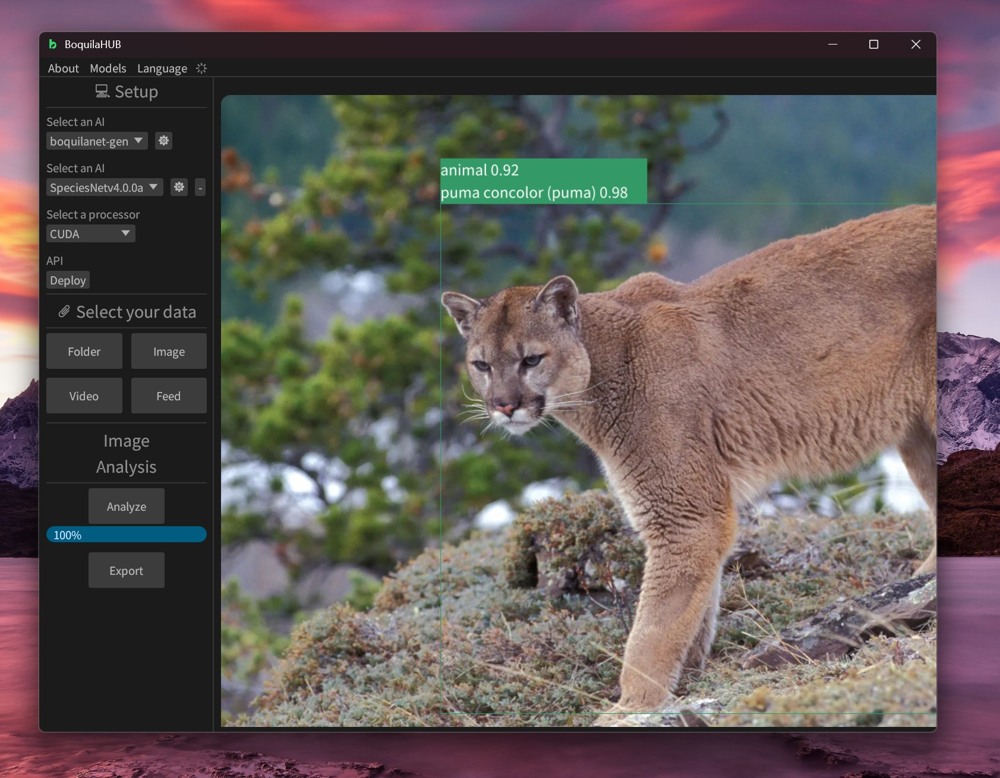

# BoquilaHUB

Cross-platform app to run AI models to monitor and protect nature. Locally, no cloud.



## Features

- Cross-platform. 
- CLI tool
- Run AIs for computer vision locally
- Process image files
- Process video files  
- Process camera feed, in real-time.  
- Deploy REST APIs, with maximum efficiency. Powered by [axum](https://github.com/tokio-rs/axum)

## AIs and binaries

Go to [boquila.org/hub](https://boquila.org/hub), download the models you want to use and just put them in your models folder, that's it. The compiled binaries are also there.

You can load any [.bq model](https://github.com/boquila/.bq). Right now, only for object detection. But in the future we will expand the format.

Right now, only object detection AIs are supported.

## List of Platforms

| Platform                           |  Production ready  |
| --------------------------------- |------------ |
| Windows          | ✅ |
| Linux          | On the way |
| Android          | On the way |
| Web        | On the way |
| MacOS          | Not soon |
| iOS          | Not soon |

## List of Runtimes

| Runtime           | Description                                                                        | Requirements  | Available?   |
|-------------------|------------------------------------------------------------------------------------|--------------|--------------|
| CPU              | Your average CPU                                                                   | Having a CPU | ✅           |
| NVIDIA CUDA      | CUDA execution provider for NVIDIA GPUs (Maxwell 7xx and above)                    | CUDA v12.8 + cuDNN 9.7 | ✅ |
| Remote BoquilaHUB | A BoquilaHUB session in your network with a deployed REST API                     | Having the URL | ✅      |
| NVIDIA TensorRT  | TensorRT execution provider for NVIDIA GPUs (GeForce 9xx series and above)         | 🚧           | 🚀 Soon      |
| AMD ROCm         | ROCm execution provider for AMD GPUs                                               | 🚧           | 🚀 Soon      |
| AMD MIGraphX     | MIGraphX execution provider for AMD GPUs                                           | 🚧           | 🚀 Soon      |
| AMD Vitis AI     | Vitis AI execution provider for Xilinx FPGA devices                                | 🚧           | 🚀 Soon      |
| Intel OpenVINO   | OpenVINO execution provider for Intel Core CPUs (6th gen and above)                | 🚧           | 🚀 Soon      |
| Intel oneDNN     | Intel oneDNN execution provider for x86/x64 targets                                | 🚧           | 🚀 Soon      |
| Microsoft DirectML | DirectML execution provider for Windows x86/x64 targets with dedicated GPUs     | 🚧           | 🚀 Soon      |
| Microsoft Azure  | Azure AI execution provider for cloud-based inference                              | 🚧           | 🚀 Soon      |
| Qualcomm QNN     | Qualcomm AI Engine Direct SDK execution provider for Qualcomm chipsets             | 🚧           | 🚀 Soon      |
| Apple CoreML     | CoreML execution provider for Apple devices                                        | 🚧           | 🚀 Soon      |
| XNNPACK         | XNNPACK execution provider for optimized inference on ARM and x86 devices           | 🚧           | 🚀 Soon      |
| Huawei CANN     | Huawei CANN execution provider for Huawei Ascend AI processors                     | 🚧           | 🚀 Soon      |
| Android NNAPI   | Android NNAPI execution provider for mobile devices with NNAPI support             | 🚧           | 🚀 Soon      |
| Apache TVM      | Apache TVM execution provider for multiple backends                                | 🚧           | 🚀 Soon      |
| Arm ACL        | Arm Compute Library (ACL) execution provider for Arm devices                        | 🚧           | 🚀 Soon      |
| ArmNN          | ArmNN execution provider for ARM-based devices                                     | 🚧           | 🚀 Soon      |
| Rockchip RKNPU | Rockchip RKNPU execution provider for Rockchip NPUs                                | 🚧           | 🚀 Soon      |

🚧 = Requirements TBA  
🚀 Soon = In progress

## How to compile

If you want to compile from source just have to

```shell
git clone https://github.com/boquila/boquilahub/
cd boquilahub
cargo build --release
```

Probably instead of cloning from main, you should prefer to get the source code from a tagged version

## Dependencies

- ONNXRuntime

- ffmpeg